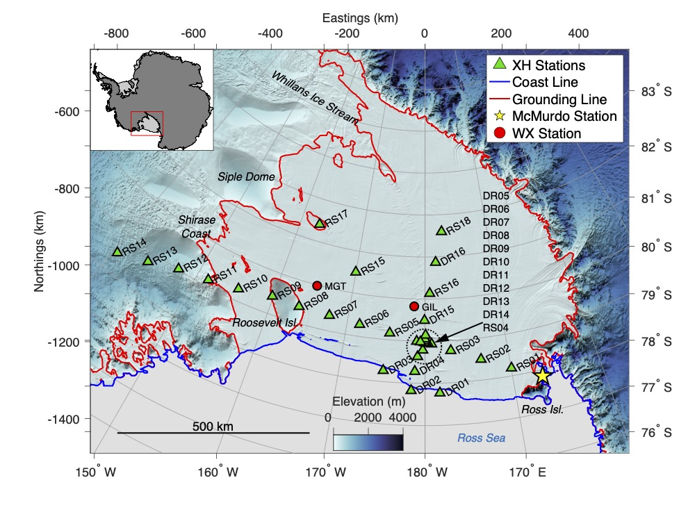

# RISCluster

RISCluster is a package that implements **deep embedded clustering** (DEC) of
seismic data recorded on the Ross Ice Shelf, Antarctica from 2014-2017. This
package is an accompaniment to a paper submitted to the Journal of Geophysical Research (Jenkins II et al., submitted).

Figure 1.  34-station passive seismic array deployed on the Ross Ice Shelf, Antarctica from 2014-2017.
***
### Installation
Pre-requisites:
[Anaconda](https://anaconda.org) or
[Miniconda](https://docs.conda.io/en/latest/miniconda.html)

The following steps will set up a Conda environment and install RISProcess, and
have been tested on MacOS 11.1 and Red Hat Enterprise Linux 7.9.  If you have
a CUDA-enabled machine (i.e., not MacOS), you can install the CUDA version of
RISCluster.  Unfortunately, Pytorch & CUML are not implemented for MacOS, so
you will need to install the CPU version if you use a Mac, or if your Linux
machine is not CUDA-capable.  This package has not been tested on Windows.

#### CUDA-enabled RISCluster (Linux)
1. Open a terminal and navigate to the directory you would like to download the
 **RISCluster_CUDA.yml** environment file.
2. Save **RISCluster_CUDA.yml** to your computer by running the following:
 `wget --no-check-certificate --content-disposition https://raw.githubusercontent.com/NeptuneProjects/RISCluster/master/RISCluster_CUDA.yml`
3. In terminal, run: `conda env create -f RISCluster_CUDA.yml`
4. Once the environment is set up and the package is installed, activate your
environment by running `conda activate RISCluster_CUDA` in terminal.

#### CPU-based RISCluster (Mac or Linux)
1. Open a terminal and navigate to the directory you would like to download the
 **RISCluster_CPU.yml** environment file.
2. Save **RISCluster_CPU.yml** to your computer by running the following:
   a. **Mac**:
   `curl -LJO https://raw.githubusercontent.com/NeptuneProjects/RISCluster/master/RISCluster_CPU.yml`
   b. **Linux**:
   `wget --no-check-certificate --content-disposition https://raw.githubusercontent.com/NeptuneProjects/RISCluster/master/RISCluster_CPU.yml`
3. In terminal, run: `conda env create -f RISCluster_CPU.yml`
4. Once the environment is set up and the package is installed, activate your
environment by running `conda activate RISCluster_CPU` in terminal.
***
### Usage
Please refer to the [RISWorkflow repository](https://github.com/NeptuneProjects/RISWorkflow) for detailed instructions on how to implement the workflow.
***
### References
*Submitted*: William F. Jenkins II, Peter Gerstoft, Michael J. Bianco, Peter D. Bromirski; *Unsupervised Deep Clustering of Seismic Data: Monitoring the Ross Ice Shelf, Antarctica.* Submitted to Journal of Geophysical Research on 20 Jan 2021; doi: https://doi.org/10.1002/essoar.10505894.2

Dylan Snover, Christopher W. Johnson, Michael J. Bianco, Peter Gerstoft; *Deep Clustering to Identify Sources of Urban Seismic Noise in Long Beach, California.* Seismological Research Letters 2020; doi: https://doi.org/10.1785/0220200164

Junyuan Xie, Ross Girshick, Ali Farhadi; *Unsupervised Deep Embedding for Clustering Analysis.* Proceedings of the 33rd International Conference on Machine Learning, New York, NY, 2016; https://arxiv.org/abs/1511.06335v2
***
### Author
Project assembled by William Jenkins
 wjenkins [@] ucsd [dot] edu
 Scripps Institution of Oceanography
 University of California San Diego
 La Jolla, California, USA
